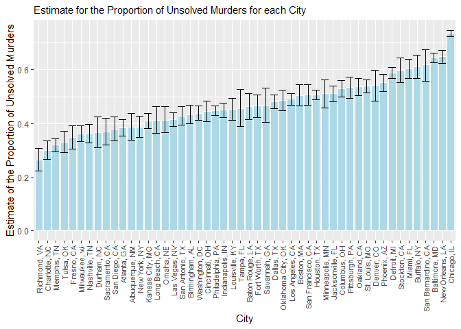
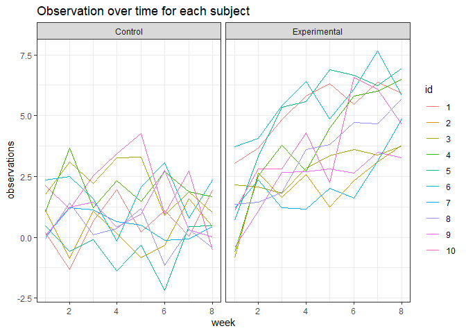

p8105\_hw5\_as6183
================

# Problem 1:

``` r
data = read.csv("./homicide/homicide-data.csv") #reading in homicide data
```

**Description of Raw Data:**

The raw data set contains 52179 rows and 12 columns. The data gives
information about the number of homicides in 50 large US cities such as
information on the victim, the outcome of the case, the location of the
crime, and the reported date of the crime.

``` r
library(tidyverse)
```

    ## -- Attaching packages ---------------------------------------- tidyverse 1.3.0 --

    ## v ggplot2 3.3.2     v purrr   0.3.4
    ## v tibble  3.0.3     v dplyr   1.0.1
    ## v tidyr   1.1.2     v stringr 1.4.0
    ## v readr   1.3.1     v forcats 0.5.0

    ## -- Conflicts ------------------------------------------- tidyverse_conflicts() --
    ## x dplyr::filter() masks stats::filter()
    ## x dplyr::lag()    masks stats::lag()

``` r
data = data%>%
  mutate(city_state = str_c(city,state,sep=", ")) #adding in city_state variable

total_hom = data%>%
  group_by(city_state)%>%
  summarise("Total Number of Homicides" = n()) #calculating total number of homicides
```

    ## `summarise()` ungrouping output (override with `.groups` argument)

``` r
unsolved_hom = data%>%
  group_by(city_state)%>%
  filter(disposition != "Closed by arrest")%>%
  summarise("Number of unsolved homicides" = n()) #calculating number of unsolved homicides
```

    ## `summarise()` ungrouping output (override with `.groups` argument)

``` r
tab = merge(total_hom,unsolved_hom,by = "city_state")%>%
  dplyr::arrange(desc(`Total Number of Homicides`)) #generating table of unsolved and total homicides for each city in data set

tab%>%
  knitr::kable()
```

| city\_state        | Total Number of Homicides | Number of unsolved homicides |
| :----------------- | ------------------------: | ---------------------------: |
| Chicago, IL        |                      5535 |                         4073 |
| Philadelphia, PA   |                      3037 |                         1360 |
| Houston, TX        |                      2942 |                         1493 |
| Baltimore, MD      |                      2827 |                         1825 |
| Detroit, MI        |                      2519 |                         1482 |
| Los Angeles, CA    |                      2257 |                         1106 |
| St. Louis, MO      |                      1677 |                          905 |
| Dallas, TX         |                      1567 |                          754 |
| Memphis, TN        |                      1514 |                          483 |
| New Orleans, LA    |                      1434 |                          930 |
| Las Vegas, NV      |                      1381 |                          572 |
| Washington, DC     |                      1345 |                          589 |
| Indianapolis, IN   |                      1322 |                          594 |
| Kansas City, MO    |                      1190 |                          486 |
| Jacksonville, FL   |                      1168 |                          597 |
| Milwaukee, wI      |                      1115 |                          403 |
| Columbus, OH       |                      1084 |                          575 |
| Atlanta, GA        |                       973 |                          373 |
| Oakland, CA        |                       947 |                          508 |
| Phoenix, AZ        |                       914 |                          504 |
| San Antonio, TX    |                       833 |                          357 |
| Birmingham, AL     |                       800 |                          347 |
| Nashville, TN      |                       767 |                          278 |
| Miami, FL          |                       744 |                          450 |
| Cincinnati, OH     |                       694 |                          309 |
| Charlotte, NC      |                       687 |                          206 |
| Oklahoma City, OK  |                       672 |                          326 |
| San Francisco, CA  |                       663 |                          336 |
| Pittsburgh, PA     |                       631 |                          337 |
| New York, NY       |                       627 |                          243 |
| Boston, MA         |                       614 |                          310 |
| Tulsa, OK          |                       583 |                          193 |
| Louisville, KY     |                       576 |                          261 |
| Fort Worth, TX     |                       549 |                          255 |
| Buffalo, NY        |                       521 |                          319 |
| Fresno, CA         |                       487 |                          169 |
| San Diego, CA      |                       461 |                          175 |
| Stockton, CA       |                       444 |                          266 |
| Richmond, VA       |                       429 |                          113 |
| Baton Rouge, LA    |                       424 |                          196 |
| Omaha, NE          |                       409 |                          169 |
| Albuquerque, NM    |                       378 |                          146 |
| Long Beach, CA     |                       378 |                          156 |
| Sacramento, CA     |                       376 |                          139 |
| Minneapolis, MN    |                       366 |                          187 |
| Denver, CO         |                       312 |                          169 |
| Durham, NC         |                       276 |                          101 |
| San Bernardino, CA |                       275 |                          170 |
| Savannah, GA       |                       246 |                          115 |
| Tampa, FL          |                       208 |                           95 |

``` r
colnames(tab) = c("city_state","Total","Unsolved") #changing column names to be more reasonable

Unsolved_Prop_Bmore =  prop.test(
  tab %>% filter(city_state == "Baltimore, MD") %>% pull(Unsolved),
tab %>% filter(city_state == "Baltimore, MD") %>% pull(Total)
     )%>%
   broom::tidy()%>%
   select(estimate,conf.low,conf.high) #performing proportion test on Baltimore's data and saving result

 
 Unsolved_Prop_Final = tab%>%
  mutate(
      prop_unsolved = map2(.x = Unsolved, .y = Total, ~prop.test(x = .x, n = .y)), 
      tidy = map(.x = prop_unsolved, ~broom::tidy(.x))
    ) %>%
  select(-prop_unsolved) %>%
  unnest(tidy) %>%
  select(city_state , estimate, conf.low, conf.high)%>%
   arrange(estimate) #calculating proportion of unsolved homicides for each city in data set using map and map2
  
 Unsolved_Prop_Final%>%
   ggplot(aes(x = reorder(city_state,estimate), y = estimate)) +
   geom_bar(stat="identity", fill = "light blue", col = "white")+
   geom_errorbar(aes(ymin = conf.low, ymax = conf.high))+
   xlab("City")+
   ylab("Estimate of the Proportion of Unsolved Murders")+
   ggtitle("Estimate for the Proportion of Unsolved Murders for each City")+
   theme(
     axis.text.x = element_text
     (
       size=8,
       angle=90,
       vjust = 0.5, 
       hjust = 1
       ),
         plot.title=element_text(size=11)
         ) #graphing proportion estimates with error bars
```

<!-- -->

# Problem 2:

``` r
setwd("./data")
files = list.files(".") #gathering file names
participant_data = files %>%        
  map(~ read_csv(.))%>%
  reduce(rbind)%>%
cbind(
  separate
  (
  data.frame(files),
  col=files,
  sep = "([._])",
  into =c("arm", "id")
)
)%>%
  pivot_longer(
    week_1:week_8,
    names_to="week",
    values_to = "observations"
 )%>%
  mutate(
    week = recode
         (
    week,
    week_1 = "1",
    week_2 = "2",
    week_3 = "3",
    week_4 = "4", 
    week_5 = "5",
    week_6 = "6",
    week_7 = "7",
    week_8 = "8"
           ),
    arm = recode(
      arm,
      con = "Control",
      exp = "Experimental"
    )
    )%>%
  mutate(week = as.numeric(week),id = factor(id)) #iterating over files and tidying resulting data for plotting
```

    ## Warning: Expected 2 pieces. Additional pieces discarded in 20 rows [1, 2, 3, 4,
    ## 5, 6, 7, 8, 9, 10, 11, 12, 13, 14, 15, 16, 17, 18, 19, 20].

``` r
ggplot(participant_data,aes(x = week, y = observations, color = id)) +
          geom_line() +
          facet_grid(.~arm)+
          theme_bw()+
          ggtitle("Observation over time for each subject")+
          ylab("Observation Value")+
          theme(legend.text = element_text(size=9)) #creating plot to compare Control and Experimental groups
```

<!-- -->

**Comments on Differences between Groups:**

From the spaghetti plot shown above we can see that the Control group in
general has a lower observation value when compared to the experimental
group. Furthermore, for the experimental group the values in general got
larger over time whereas in the control group the values never got very
large even though both the control and experimental groups started off
at similar values. This can be seen especially in the later weeks as the
experimental values are much higher than the control values at these
times.

# Problem 3:

``` r
library(patchwork)

#setting up standard variables n and sd as well as initial value for mu

n = 30
sd = 5
mu = 0

set.seed(234) #setting seed so we get same results every time we run code

sim_mean_t_test = function(n,mu ,sd) {
  
  sim_data = tibble(
    x = rnorm(n, mean = mu, sd = sd),
  )
  
  t.test(sim_data, mu = 0)%>%
    broom::tidy()%>%
    dplyr::select(estimate,p.value)
} #creating function to run t test and estimate mu

sim_results_mu_equals_0 = 
  rerun(5000, sim_mean_t_test(n, mu, sd)) %>% 
  bind_rows() #only running function for mu = 0

sim_results_diff_mus = 
  tibble(mu = seq(0,6)) %>% 
  mutate(
    output_lists = map(.x = mu, ~rerun(5000, sim_mean_t_test(n = n,mu = .x, sd = sd))),
    estimate_dfs = map(output_lists, bind_rows)) %>% 
  select(-output_lists) %>% 
  unnest(estimate_dfs) #running function for when mu equals 0 to 6

num_rej = sim_results_diff_mus%>%
  group_by(mu)%>%
  filter(p.value<0.05)%>%
  summarize(n_rej = n()) #calculating number of rejected mu values
```

    ## `summarise()` ungrouping output (override with `.groups` argument)

``` r
num_rej%>%
  ggplot(
    aes(
      mu,
      n_rej/5000,
      fill = mu
      ),
    col = "black"
    )+
  geom_bar(stat="identity")+
  ggtitle("Proportion of times null was rejected with different mu values")+
  xlab("True Value of mu")+
  ylab("Proportion of Times Null Was Rejected")+
  geom_text(aes(label=n_rej/5000),position = position_nudge(y=0.04))+
  scale_x_continuous(breaks=seq(0,6))+
  theme(title = element_text(size=10)) #plotting proportion of rejections for each mu value
```

<!-- -->

**Explanation of Graph:**

When the true mu value increases further and further away from 0, the
effect size increases as the true mu value is further and further away
from what we are supposed to get in the null hypothesis. From the graph
we can see that as the effect size increases, the power or the
proportion of times the null hypothesis was rejected increases. This
make sense because our null hypothesis is that mu = 0 so when mu = 0,
the null hypothesis should be rejected the least when compared to higher
values of mu. Therefore, from this graph we can conclude that when the
effect size increases, the power of the test increases.

``` r
plot_1 = sim_results_diff_mus%>%
  group_by(mu)%>%
  summarise(avg_mu_hat = mean(estimate))%>%
  ggplot(aes(mu,avg_mu_hat))+
  geom_point(size = 4)+
  ggtitle("True mu vs Average estimate of mu")+
  ylab("Average estimate of mu")+
  geom_text(
    aes(label=round(avg_mu_hat,2)),
    size=4,
    position = position_nudge(y = 0.4)
    )+
  xlab("True Value of mu")+
  scale_x_continuous(breaks=seq(0,6),limits = c(-0.5,6.5))+
  theme(title = element_text(size=10)) #plotting average of all mu estimates for each tru mu value
```

    ## `summarise()` ungrouping output (override with `.groups` argument)

``` r
plot_2 = sim_results_diff_mus%>%
  filter(p.value<0.05)%>%
  group_by(mu)%>%
  summarise(avg_mu_hat = mean(estimate))%>%
  ggplot(aes(mu,avg_mu_hat))+
  geom_point(size = 4)+
  ggtitle("True mu vs Average estimate of mu for rejected")+
  ylab("Average estimate of mu when null was rejected")+
  geom_text(
    aes(label=round(avg_mu_hat,2)),
    size=4,
    position = position_nudge(y = 0.4)
    )+
  scale_x_continuous(breaks=seq(0,6),limits=c(-0.5,6.5))+
  xlab("True Value of mu")+
  theme(title = element_text(size=8)) #plotting average of mu estimates only when null hypothesis was rejected for each mu value
```

    ## `summarise()` ungrouping output (override with `.groups` argument)

``` r
plot_1 + plot_2 #combining two plots side by side
```

<!-- -->

**Explanation for graph of sample average of mu when null hypothesis is
rejected:**

When restricting the data to only samples where the null hypothesis was
rejected, the mean estimate of mu is approximately equal to the true
value of mu when the true mu value is large (true mu = 4,5, and 6) as
well as when the true mu = 0. This makes sense because our null
hypothesis was mu = 0 and thus if our estimate of mu is well above 0
which it should be when the true mu is 4,5, or 6, the null hypothesis
will be rejected very frequently. Thus, most of the estimates for these
true mu values would be included in the “rejection” data so any outliers
would not have a very big effect on the mean estimate due to the larger
sample size. For true mu’s of 1, 2, and 3, the average estimate of mu
was high compared to the true value of mu. This could be due to the true
mu’s being closer to 0 which means we reject less samples. This means
that outliers in the estimates for these smaller mu values would have
more of an impact on the average of the rejection data because the
rejection data would be smaller. This can also been seen from how when
the mean estimates of the full data were graphed (left graph), the mean
estimates for true mu’s of 1, 2, and 3 were very close to the true mu
value. Furthermore, the trend of the mean estimates being closer to the
true mu value when the true mu value is higher can be seen by how the
values of the average estimate of mu get closer to the true value of mu
as the true value of mu increases on the right graph. For mu = 0, the
number of times the null hypothesis was rejected was much lower when
compared to the other mu values which makes sense as our null hypothesis
was that mu = 0. The proportion of rejection for mu = 0 was actually
0.051 which is close to our significance level of 0.05 thus indicating
that type I errors or rejecting the null hypothesis when it is true
could be why our estimated mean mu is so close to 0 and not effected as
much by outliers as when the true mu value is 1, 2, or 3.
