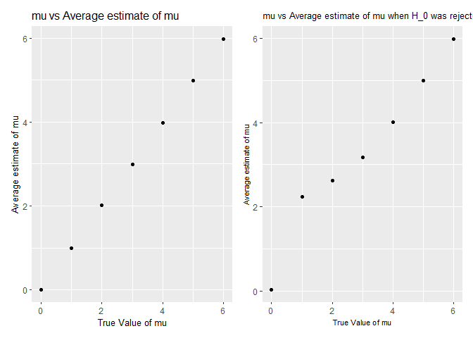

p8105\_hw5\_as6183
================

# Problem 1:

``` r
data = read.csv("C:/Users/13038/Downloads/homicide-data.csv") 
```

**Description of Raw Data:**

``` r
library(tidyverse)
```

    ## -- Attaching packages ---------------------------------------- tidyverse 1.3.0 --

    ## v ggplot2 3.3.2     v purrr   0.3.4
    ## v tibble  3.0.3     v dplyr   1.0.1
    ## v tidyr   1.1.2     v stringr 1.4.0
    ## v readr   1.3.1     v forcats 0.5.0

    ## -- Conflicts ------------------------------------------- tidyverse_conflicts() --
    ## x dplyr::filter() masks stats::filter()
    ## x dplyr::lag()    masks stats::lag()

``` r
data = data%>%
  mutate(city_state = paste(city,state,sep=", "))

tab_1 = data%>%
  group_by(city_state)%>%
  summarise("Total Number of Homicides" = n())
```

    ## `summarise()` ungrouping output (override with `.groups` argument)

``` r
tab_2 = data%>%
  group_by(city_state)%>%
  filter(disposition != "Closed by arrest")%>%
  summarise("Number of unsolved homicides" = n())
```

    ## `summarise()` ungrouping output (override with `.groups` argument)

``` r
tab_final = merge(tab_1,tab_2,by = "city_state")%>%
  dplyr::arrange(desc(`Total Number of Homicides`))

tab_final%>%
  knitr::kable()
```

| city\_state        | Total Number of Homicides | Number of unsolved homicides |
| :----------------- | ------------------------: | ---------------------------: |
| Chicago, IL        |                      5535 |                         4073 |
| Philadelphia, PA   |                      3037 |                         1360 |
| Houston, TX        |                      2942 |                         1493 |
| Baltimore, MD      |                      2827 |                         1825 |
| Detroit, MI        |                      2519 |                         1482 |
| Los Angeles, CA    |                      2257 |                         1106 |
| St. Louis, MO      |                      1677 |                          905 |
| Dallas, TX         |                      1567 |                          754 |
| Memphis, TN        |                      1514 |                          483 |
| New Orleans, LA    |                      1434 |                          930 |
| Las Vegas, NV      |                      1381 |                          572 |
| Washington, DC     |                      1345 |                          589 |
| Indianapolis, IN   |                      1322 |                          594 |
| Kansas City, MO    |                      1190 |                          486 |
| Jacksonville, FL   |                      1168 |                          597 |
| Milwaukee, wI      |                      1115 |                          403 |
| Columbus, OH       |                      1084 |                          575 |
| Atlanta, GA        |                       973 |                          373 |
| Oakland, CA        |                       947 |                          508 |
| Phoenix, AZ        |                       914 |                          504 |
| San Antonio, TX    |                       833 |                          357 |
| Birmingham, AL     |                       800 |                          347 |
| Nashville, TN      |                       767 |                          278 |
| Miami, FL          |                       744 |                          450 |
| Cincinnati, OH     |                       694 |                          309 |
| Charlotte, NC      |                       687 |                          206 |
| Oklahoma City, OK  |                       672 |                          326 |
| San Francisco, CA  |                       663 |                          336 |
| Pittsburgh, PA     |                       631 |                          337 |
| New York, NY       |                       627 |                          243 |
| Boston, MA         |                       614 |                          310 |
| Tulsa, OK          |                       583 |                          193 |
| Louisville, KY     |                       576 |                          261 |
| Fort Worth, TX     |                       549 |                          255 |
| Buffalo, NY        |                       521 |                          319 |
| Fresno, CA         |                       487 |                          169 |
| San Diego, CA      |                       461 |                          175 |
| Stockton, CA       |                       444 |                          266 |
| Richmond, VA       |                       429 |                          113 |
| Baton Rouge, LA    |                       424 |                          196 |
| Omaha, NE          |                       409 |                          169 |
| Albuquerque, NM    |                       378 |                          146 |
| Long Beach, CA     |                       378 |                          156 |
| Sacramento, CA     |                       376 |                          139 |
| Minneapolis, MN    |                       366 |                          187 |
| Denver, CO         |                       312 |                          169 |
| Durham, NC         |                       276 |                          101 |
| San Bernardino, CA |                       275 |                          170 |
| Savannah, GA       |                       246 |                          115 |
| Tampa, FL          |                       208 |                           95 |

``` r
colnames(tab_final) = c("city_state","Total","Unsolved")

Baltimore_Unsolved = tab_final%>%
   filter(city_state == "Baltimore, MD")

 Unsolved_Prop_Bmore =
   prop.test(
             pull(Baltimore_Unsolved,`Unsolved`),
             pull(Baltimore_Unsolved,`Total`)
     )%>%
   broom::tidy()%>%
   select(estimate,conf.low,conf.high)%>%
   mutate(city_state = pull(Baltimore_Unsolved,city_state))%>%
   select(city_state,estimate,conf.low,conf.high)


prop_test_func = function(data) {
  prop.test(pull(data,Unsolved),pull(data,Total))%>%
    broom::tidy()%>%
    select(estimate,conf.low,conf.high)
}
 
 Unsolved_Prop_Final = tab_final%>%
   group_by(city_state)%>%
   mutate(Total = as.double(Total), Unsolved = as.double(Unsolved))%>%
   nest()%>%
  mutate(prop_unsolved = map(data, prop_test_func))%>%
   unnest()%>%
   arrange(estimate)
```

    ## Warning: `cols` is now required when using unnest().
    ## Please use `cols = c(data, prop_unsolved)`

``` r
 Unsolved_Prop_Final%>%
   ggplot(aes(x = reorder(city_state,estimate), y = estimate)) +
   geom_bar(stat="identity")+
   geom_errorbar(aes(ymin = conf.low, ymax = conf.high))+
   xlab("City")+
   ylab("Estimate of the Proportion of Unsolved Murders")+
   ggtitle("Estimate for the Proportion of Unsolved Murders for each City")+
   theme(axis.text.x = element_text(size=8,angle=90,vjust = 0.5, hjust = 1),plot.title=element_text(size=11))
```

<!-- -->

# Problem 2:

``` r
setwd("./data")
files = list.files(".")
data = purrr::map_dfr(files,read.csv)%>%
  mutate(id = c(paste0("Control"," ",seq(1,10)),paste0("Experiment"," ",seq(1,10))))%>%
  pivot_longer(week_1:week_8,names_to="week",values_to = "observations")%>%
  mutate(week = recode(week,week_1 = "1", week_2 = "2", week_3 = "3", week_4 = "4", week_5 = "5", week_6 = "6", week_7 = "7", week_8 = "8"))%>%
  mutate(week = as.numeric(week))

ggplot(data,aes(x = week, y = observations, color = id)) +
          geom_line() +
          theme_bw()+
          ggtitle("Observation over time for each subject")+
          theme(legend.title = element_blank(),legend.text = element_text(size=9))
```

<!-- -->

# Problem 3:

``` r
library(patchwork)

n = 30
sd = 5
mu = 0
set.seed(234)
sim_mean_sd = function(n,mu ,sd) {
  
  sim_data = tibble(
    x = rnorm(n, mean = mu, sd = sd),
  )
  
  t_test = t.test(pull(sim_data,x), mu = mu)%>%
    broom::tidy()%>%
    dplyr::select(p.value)
  
  sim_data %>% 
    summarize(
      mu_hat = mean(x),
      p_val = t_test
    )
}

sim_results = 
  rerun(5000, sim_mean_sd(30, 0, 5)) %>% 
  bind_rows()

sim_results_diff_mus = 
  tibble(mu = seq(0,6)) %>% 
  mutate(
    output_lists = map(.x = mu, ~rerun(5000, sim_mean_sd(n = 30,mu = .x, sd = 5))),
    estimate_dfs = map(output_lists, bind_rows)) %>% 
  select(-output_lists) %>% 
  unnest(estimate_dfs)

num_rej = sim_results_diff_mus%>%
  group_by(mu)%>%
  filter(p_val<0.05)%>%
  summarize(n_rej = n())
```

    ## `summarise()` ungrouping output (override with `.groups` argument)

``` r
df = num_rej%>%
  mutate(prop_rej = n_rej/5000)

df%>%
  ggplot(aes(mu,prop_rej))+
  geom_point()+
  ggtitle("mu vs proportion of times null was rejected")+
  xlab("True Value of mu")+
  ylab("Proportion of Times Null Was Rejected")+
  theme(title = element_text(size=10))
```

<!-- -->

``` r
plot_1 = sim_results_diff_mus%>%
  group_by(mu)%>%
  summarise(avg_mu_hat = mean(mu_hat))%>%
  ggplot(aes(mu,avg_mu_hat))+
  geom_point()+
  ggtitle("mu vs Average estimate of mu")+
  xlab("True Value of mu")+
  ylab("Average estimate of mu")+
  theme(title = element_text(size=10))
```

    ## `summarise()` ungrouping output (override with `.groups` argument)

``` r
plot_2 = sim_results_diff_mus%>%
  filter(p_val<0.05)%>%
  group_by(mu)%>%
  summarise(avg_mu_hat = mean(mu_hat))%>%
  ggplot(aes(mu,avg_mu_hat))+
  geom_point()+
  ggtitle("mu vs Average estimate of mu when H_0 was rejected")+
  xlab("True Value of mu")+
  ylab("Average estimate of mu")+
  theme(title = element_text(size=8))
```

    ## `summarise()` ungrouping output (override with `.groups` argument)

``` r
plot_1 + plot_2
```

<!-- -->
