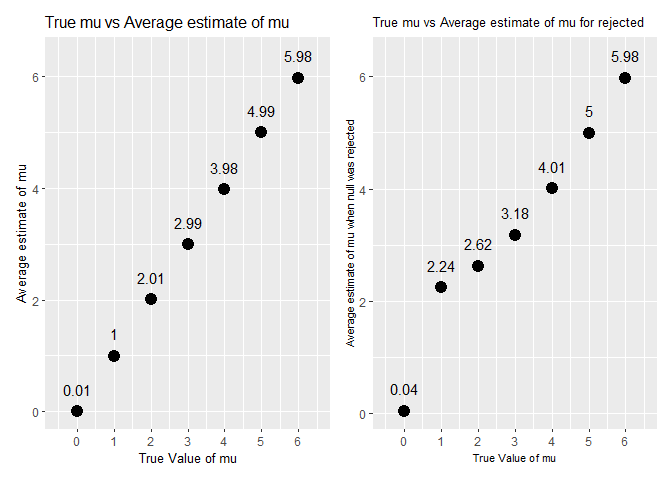

p8105\_hw5\_as6183
================

# Problem 1:

``` r
data = read.csv("C:/Users/13038/Downloads/homicide-data.csv") 
```

**Description of Raw Data:**

The raw data set contains 52179 rows and 12 columns. The data gives
information about the number of homicides in 50 large US cities such as
information on the victim, the outcome of the case, the location of the
crime, and the reported date of the crime.

``` r
library(tidyverse)
```

    ## -- Attaching packages ---------------------------------------- tidyverse 1.3.0 --

    ## v ggplot2 3.3.2     v purrr   0.3.4
    ## v tibble  3.0.3     v dplyr   1.0.1
    ## v tidyr   1.1.2     v stringr 1.4.0
    ## v readr   1.3.1     v forcats 0.5.0

    ## -- Conflicts ------------------------------------------- tidyverse_conflicts() --
    ## x dplyr::filter() masks stats::filter()
    ## x dplyr::lag()    masks stats::lag()

``` r
data = data%>%
  mutate(city_state = str_c(city,state,sep=", "))

tab_1 = data%>%
  group_by(city_state)%>%
  summarise("Total Number of Homicides" = n())
```

    ## `summarise()` ungrouping output (override with `.groups` argument)

``` r
tab_2 = data%>%
  group_by(city_state)%>%
  filter(disposition != "Closed by arrest")%>%
  summarise("Number of unsolved homicides" = n())
```

    ## `summarise()` ungrouping output (override with `.groups` argument)

``` r
tab_final = merge(tab_1,tab_2,by = "city_state")%>%
  dplyr::arrange(desc(`Total Number of Homicides`))

tab_final%>%
  knitr::kable()
```

| city\_state        | Total Number of Homicides | Number of unsolved homicides |
| :----------------- | ------------------------: | ---------------------------: |
| Chicago, IL        |                      5535 |                         4073 |
| Philadelphia, PA   |                      3037 |                         1360 |
| Houston, TX        |                      2942 |                         1493 |
| Baltimore, MD      |                      2827 |                         1825 |
| Detroit, MI        |                      2519 |                         1482 |
| Los Angeles, CA    |                      2257 |                         1106 |
| St. Louis, MO      |                      1677 |                          905 |
| Dallas, TX         |                      1567 |                          754 |
| Memphis, TN        |                      1514 |                          483 |
| New Orleans, LA    |                      1434 |                          930 |
| Las Vegas, NV      |                      1381 |                          572 |
| Washington, DC     |                      1345 |                          589 |
| Indianapolis, IN   |                      1322 |                          594 |
| Kansas City, MO    |                      1190 |                          486 |
| Jacksonville, FL   |                      1168 |                          597 |
| Milwaukee, wI      |                      1115 |                          403 |
| Columbus, OH       |                      1084 |                          575 |
| Atlanta, GA        |                       973 |                          373 |
| Oakland, CA        |                       947 |                          508 |
| Phoenix, AZ        |                       914 |                          504 |
| San Antonio, TX    |                       833 |                          357 |
| Birmingham, AL     |                       800 |                          347 |
| Nashville, TN      |                       767 |                          278 |
| Miami, FL          |                       744 |                          450 |
| Cincinnati, OH     |                       694 |                          309 |
| Charlotte, NC      |                       687 |                          206 |
| Oklahoma City, OK  |                       672 |                          326 |
| San Francisco, CA  |                       663 |                          336 |
| Pittsburgh, PA     |                       631 |                          337 |
| New York, NY       |                       627 |                          243 |
| Boston, MA         |                       614 |                          310 |
| Tulsa, OK          |                       583 |                          193 |
| Louisville, KY     |                       576 |                          261 |
| Fort Worth, TX     |                       549 |                          255 |
| Buffalo, NY        |                       521 |                          319 |
| Fresno, CA         |                       487 |                          169 |
| San Diego, CA      |                       461 |                          175 |
| Stockton, CA       |                       444 |                          266 |
| Richmond, VA       |                       429 |                          113 |
| Baton Rouge, LA    |                       424 |                          196 |
| Omaha, NE          |                       409 |                          169 |
| Albuquerque, NM    |                       378 |                          146 |
| Long Beach, CA     |                       378 |                          156 |
| Sacramento, CA     |                       376 |                          139 |
| Minneapolis, MN    |                       366 |                          187 |
| Denver, CO         |                       312 |                          169 |
| Durham, NC         |                       276 |                          101 |
| San Bernardino, CA |                       275 |                          170 |
| Savannah, GA       |                       246 |                          115 |
| Tampa, FL          |                       208 |                           95 |

``` r
colnames(tab_final) = c("city_state","Total","Unsolved")

Baltimore_Unsolved = tab_final%>%
   filter(city_state == "Baltimore, MD")

 Unsolved_Prop_Bmore =
   prop.test(
             pull(Baltimore_Unsolved,`Unsolved`),
             pull(Baltimore_Unsolved,`Total`)
     )%>%
   broom::tidy()%>%
   select(estimate,conf.low,conf.high)

 
 Unsolved_Prop_Final = tab_final%>%
  mutate(
      prop_unsolved = map2(.x = Unsolved, .y = Total, ~prop.test(x = .x, n = .y)), 
      tidy = map(.x = prop_unsolved, ~broom::tidy(.x))
    ) %>%
  select(-prop_unsolved) %>%
  unnest(tidy) %>%
  select(city_state , estimate, conf.low, conf.high)%>%
   arrange(estimate)
  
 Unsolved_Prop_Final%>%
   ggplot(aes(x = reorder(city_state,estimate), y = estimate)) +
   geom_bar(stat="identity")+
   geom_errorbar(aes(ymin = conf.low, ymax = conf.high))+
   xlab("City")+
   ylab("Estimate of the Proportion of Unsolved Murders")+
   ggtitle("Estimate for the Proportion of Unsolved Murders for each City")+
   theme(axis.text.x = element_text(size=8,angle=90,vjust = 0.5, hjust = 1),plot.title=element_text(size=11))
```

<!-- -->

# Problem 2:

``` r
setwd("./data")
files = list.files(".")
data = files %>%          
  map(~ read_csv(.))%>%
  reduce(rbind) %>%
  mutate(Control_Exp = c(rep("Control",10),rep("Experimental",10)),id = c(seq("1","10"),seq("1","10")))%>%
  pivot_longer(week_1:week_8,names_to="week",values_to = "observations")%>%
  mutate(week = recode(week,week_1 = "1", week_2 = "2", week_3 = "3", week_4 = "4", week_5 = "5", week_6 = "6", week_7 = "7", week_8 = "8"))%>%
  mutate(week = as.numeric(week), id = factor(id))

ggplot(data,aes(x = week, y = observations, color = id)) +
          geom_line() +
          facet_grid(.~Control_Exp)+
          theme_bw()+
          ggtitle("Observation over time for each subject")+
          theme(legend.text = element_text(size=9))
```

<!-- -->

**Comments on Differences between Groups:**

From the spaghetti plot shown above we can see that the Control group in
general has a lower observation value when compared to the experimental
group. Furthermore, for the experimental group the values in general got
larger over time whereas in the control group the values never got very
large even though both the control and experimental groups started off
at similar values. This can be seen especially in the later weeks as the
experimental values are much higher than the control values at these
times.

# Problem 3:

``` r
library(patchwork)

n = 30
sd = 5
mu = 0
set.seed(234)
sim_mean_t_test = function(n,mu ,sd) {
  
  sim_data = tibble(
    x = rnorm(n, mean = mu, sd = sd),
  )
  
  t.test(sim_data, mu = 0)%>%
    broom::tidy()%>%
    dplyr::select(estimate,p.value)
}

sim_results_mu_equals_0 = 
  rerun(5000, sim_mean_t_test(30, 0, 5)) %>% 
  bind_rows()

sim_results_diff_mus = 
  tibble(mu = seq(0,6)) %>% 
  mutate(
    output_lists = map(.x = mu, ~rerun(5000, sim_mean_t_test(n = 30,mu = .x, sd = 5))),
    estimate_dfs = map(output_lists, bind_rows)) %>% 
  select(-output_lists) %>% 
  unnest(estimate_dfs)

num_rej = sim_results_diff_mus%>%
  group_by(mu)%>%
  filter(p.value<0.05)%>%
  summarize(n_rej = n())
```

    ## `summarise()` ungrouping output (override with `.groups` argument)

``` r
num_rej%>%
  ggplot(aes(mu,n_rej/5000,fill = mu),col = "black")+
  geom_bar(stat="identity")+
  ggtitle("Proportion of times null was rejected with different mu values")+
  xlab("True Value of mu")+
  ylab("Proportion of Times Null Was Rejected")+
  geom_text(aes(label=n_rej/5000),position = position_nudge(y=0.04))+
  scale_x_continuous(breaks=seq(0,6))+
  theme(title = element_text(size=10))
```

<!-- -->

**Explanation of Graph:**

When the true mu value increases further and further away from 0, the
effect size increases as the true mu value is further and further away
from what we are supposed to get in the null hypothesis. From the graph
we can see that as the effect size increases, the power or the
proportion of times the null hypothesis was rejected increases. This
make sense because our null hypothesis is that mu = 0 so when mu = 0,
the null hypothesis should be rejected the least when compared to higher
values of mu. Therefore, from this graph we can conclude there is a
strong positive correlation between effect size and power.

``` r
plot_1 = sim_results_diff_mus%>%
  group_by(mu)%>%
  summarise(avg_mu_hat = mean(estimate))%>%
  ggplot(aes(mu,avg_mu_hat))+
  geom_point()+
  ggtitle("True mu vs Average estimate of mu")+
  ylab("Average estimate of mu")+
  geom_text(aes(label=round(avg_mu_hat,3)),size=2.5,position = position_nudge(y = 0.2))+
  xlab("True Value of mu")+
  scale_x_continuous(breaks=seq(0,6))+
  theme(title = element_text(size=10))
```

    ## `summarise()` ungrouping output (override with `.groups` argument)

``` r
plot_2 = sim_results_diff_mus%>%
  filter(p.value<0.05)%>%
  group_by(mu)%>%
  summarise(avg_mu_hat = mean(estimate))%>%
  ggplot(aes(mu,avg_mu_hat))+
  geom_point()+
  ggtitle("True mu vs Average estimate of mu for rejected")+
  ylab("Average estimate of mu")+
  geom_text(aes(label=round(avg_mu_hat,3)),size=2.5,position = position_nudge(y = 0.2))+
  scale_x_continuous(breaks=seq(0,6))+
  xlab("True Value of mu")+
  theme(title = element_text(size=8))
```

    ## `summarise()` ungrouping output (override with `.groups` argument)

``` r
plot_1 + plot_2
```

<!-- -->

**Explanation for graph of sample average of mu when null hypothesis is
rejected:**

The sample average of mu is approximately equal to the true value of mu
for only the samples where the null hypothesis is rejected for the
larger mu values (3,4,5, and 6) as well as when mu = 0. This makes sense
because our null hypothesis was mu = 0 thus if our estimate of mu is
well above 0 which it should be when the true mu is 3,4,5, or 6 the null
hypothesis will be rejected very frequently. Thus, most of the estimates
for these true mu values would be included in the “rejection” data which
is why the average estimate for these mu’s are close to the true mu
value as any outliers would not have a very big effect due to the larger
sample size. For true mu’s of 1 and 2, the average estimate of mu was
high compared to the true value of mu. This could be due to the true
mu’s being closer to 0 which means we reject less samples. This means
that outliers in the estimates for these smaller mu values would have
more of an impact on the average of the rejection data because the
rejection data would be smaller. Furthermore, this trend can also be
seen by how the values of the average estimate of mu get closer to the
true value of mu as the true value of mu increases. For mu = 0, the
number of times the null hypothesis was rejected was much lower when
compared to the other mu values which makes sense as our null hypothesis
was that mu = 0. The proportion of rejection for mu = 0 was actually
0.051 which is close to our significance level of 0.05 thus indicating
that type I errors or rejecting the null hypothesis when it is true
could be why our estimated mean mu is so close to 0 and not effected as
much by outliers as when the true mu value is 1 or 2.
